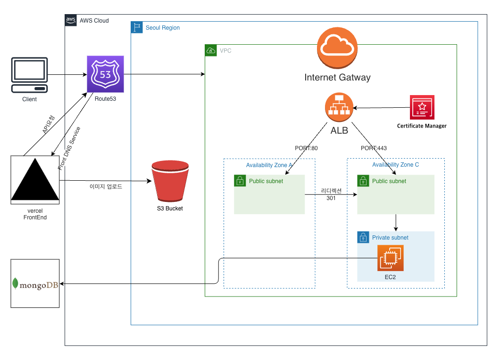
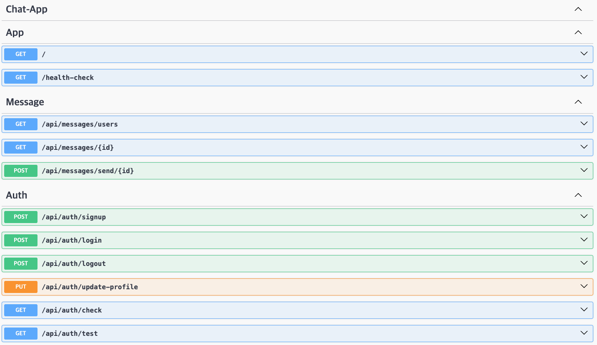

# 채팅 어플리케이션 (클론 코딩)

### 따라한 클론코딩 강의 URL :  https://www.youtube.com/watch?v=ntKkVrQqBYY

### Site URL : https://chat.lsapee.com

### 사양

- 언어: TypeScript
- 프레임워크: Next, Nest
- 사용 툴: webStorm
- 배포 환경: AWS EC2, Vercel
- 사용 DB: MongeDB atlas

### AWS 아키텍처 

1. backend 서버 EC2 + PM2 배포.
2. ALB + Route53 + CM을 이용하여 HTTPS 프로토콜 사용.
3. S3 이미지 업로드용 스토리지.
4. MongoDB Atlas 사용.
5. Frontend vercel을 이용하여 배포.
6. vercel+route53을 사용하여 도메인 고정.

### API 

